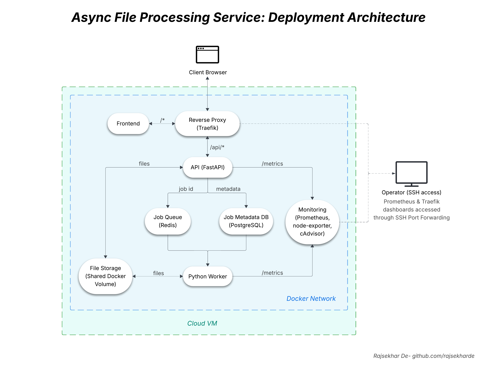

# Async Image/PDF Processing Application

## Architecture Diagram



## Tech Stack

- **Traefik**: Routing, Automatic HTTPS
- **FastAPI**: Backend APIs
- **Redis**: Job Queue
- **PostgreSQL**: Job/File Metadata
- **Docker, Docker compose**: Containerization

## Project Structure

```bash
async-file-processing
├── api
│   ├── alembic
│   │   ├── env.py
│   │   └── versions
│   ├── alembic.ini
│   ├── Dockerfile
│   ├── requirements.txt
│   └── src
│       ├── api_schemas
│       │   └── schemas.py
│       ├── database
│       │   ├── engine.py
│       │   └── session.py
│       ├── main.py
│       └── models
│           └── jobs_job_files.py
│── worker
│   ├── Dockerfile
│   ├── requirements.txt
│   └── src
│       └── worker.py
├── frontend
│   ├── Dockerfile
│   ├── index.html
│   ├── style.css
│   └── app.js
├── media
├── file-storage
├── docker-compose.yml
└── README.md
```

tree -L 4

## Running locally using docker compose

Install docker & docker compose. Make sure docker engine is running.

Clone git repository:

```bash
git clone https://github.com/rajsekharde/async-file-processing.git
cd async-file-processing
```

Create .env file in root project folder. Add following variables:

```bash
POSTGRES_USER=username
POSTGRES_PASSWORD=password
POSTGRES_DB=db

DB_HOST=database
DB_PORT=5432

JOB_TOKEN_EXPIRE_DAYS=7
```

Build and run the containers using docker compose:

```bash
docker compose up --build -d
docker ps # Inspect running containers
```

Run alembic migrations inside docker to initialize database:

```bash
docker exec -it api-f alembic upgrade head
```

Inspect the database using psql:

```bash
docker exec -it postgres-f psql -U username -d db

\dt # List tables
\d jobs # Check columns of jobs table
\d job_files # Check columns of job_files table
```

Shut down the containers:

```bash
docker compose down
```